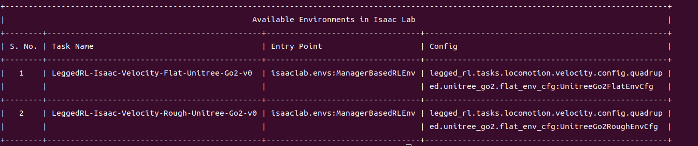

<h1 align="center">legged_rl</h1>

<p align="center">
  
</p>

<p align="center">
  <a href="readme.md">中文</a> | <a href="readmd_EN.md">English</a>
</p>

这是一份基于Isaac Sim的四足机器狗强化学习项目，基于[rl_sar](https://github.com/fan-ziqi/rl_sar)实现sim2sim测试与真机部署测试。当前阶段使用[robot_lab](https://github.com/fan-ziqi/robot_lab)中有关四足机器狗的mdp和奖励函数完成Unitree Go2的强化学习训练和play测试。有关himloco模式的实现，请查看版本分支介绍。
# 版本分支介绍
- [main](https://github.com/yanyuze1/legged_rl/tree/main): 默认分支，稳定支持rl_sar使用robot_lab部署实现
- [dev](https://github.com/yanyuze1/legged_rl/tree/dev): 测试分支，测试开发版本，当前非稳定支持rl_sar使用himloco模式部署实现
# 项目结构图


# 快速开始
## 项目环境
- 创建conda环境
```bash
conda create -n legged_rl python=3.11
conda activate legged_rl
```
- 安装torch
```bash
python -m pip install -U torch==2.7.0 torchvision==0.22.0 --index-url https://download.pytorch.org/whl/cu128
```
- 安装isaacsim和isaaclab
```bash
python -m pip install isaaclab[isaacsim,all]==2.3.0 --extra-index-url https://pypi.nvidia.com
```
- 安装legged_rl项目
```bash
git clone https://github.com/yanyuze1/legged_rl.git
cd legged_rl
python -m pip install -e source/legged_rl
```

- 安装wand、rsl_rl和cusrl
```bash
python -m pip install wandb
cd legged_rl/source/legged_rl/rsl_rl
python -m pip install -e .
python -m pip install cusrl[all]
```

## 项目使用
### 列出所有可用任务
```bash
cd legged_rl
python scripts/list_envs.py
```

### 训练(train)

- 平地训练
```bash
python scripts/rsl_rl/train.py \
  --task=LeggedRL-Isaac-Velocity-Flat-Unitree-Go2-v0 \
  --num_envs 4096 \
  --headless
python scripts/cusrl/train.py \
  --task=LeggedRL-Isaac-Velocity-Flat-Unitree-Go2-v0 \
  --num_envs 4096 \
  --headless
```
- 坡地训练
```bash
python scripts/rsl_rl/train.py \
  --task=LeggedRL-Isaac-Velocity-Rough-Unitree-Go2-v0 \
  --num_envs 4096 \
  --headless
python scripts/cusrl/train.py \
  --task=LeggedRL-Isaac-Velocity-Rough-Unitree-Go2-v0 \
  --num_envs 4096 \
  --headless
```
- 恢复训练
```bash
python scripts/rsl_rl/train.py \
  --task=LeggedRL-Isaac-Velocity-Flat-Unitree-Go2-v0 \
  --num_envs 4096 \
  --headless \
  --resume \
  --load_run 2026-06-19_20-38-06 \
  --checkpoint model_100.pt
python scripts/cusrl/train.py \
  --task=LeggedRL-Isaac-Velocity-Flat-Unitree-Go2-v0 \
  --num_envs 4096 \
  --headless \
  --resume \
  --load_run 2026-06-19_20-38-06 \
  --checkpoint model_100.pt
```
### 推理(play)
- 平地推理
```bash
python scripts/rsl_rl/play.py \
    --task=LeggedRL-Isaac-Velocity-Flat-Unitree-Go2-v0 \
    --num_envs 16
python scripts/cusrl/play.py \
    --task=LeggedRL-Isaac-Velocity-Flat-Unitree-Go2-v0 \
    --num_envs 16
```

- 坡地推理
```bash
python scripts/rsl_rl/play.py \
    --task=LeggedRL-Isaac-Velocity-Rough-Unitree-Go2-v0 \
    --num_envs 16
python scripts/cusrl/play.py \
    --task=LeggedRL-Isaac-Velocity-Rough-Unitree-Go2-v0 \
    --num_envs 16
```


## sim2sim与真机部署
- 本项目真机部署支持使用[rl_sar](https://github.com/fan-ziqi/rl_sar)实现sim2sim测试与真机部署测试。
- 关于版本分支方面，[main](https://github.com/yanyuze1/legged_rl/tree/main)分支支持robot_lab模式下进行部署。[dev](https://github.com/yanyuze1/legged_rl/tree/dev)分支下支持himloco模式下进行部署(测试开发版本)。

# 强化学习框架
## RSL_RL


有关rsl_rl的详细学习可以看[二营长的视频](https://www.bilibili.com/video/BV1KJdgB1EuA/?spm_id_from=333.1391.0.0&vd_source=d2c056c41b6dadc7b66b4f6b51f235fc)
# 致谢
- [robot_lab](https://github.com/fan-ziqi/robot_lab)
- [legged_lab](https://github.com/zhw0422/legged_lab)
- [RSL_RL](https://github.com/leggedrobotics/rsl_rl)
- [CUSRL](https://github.com/chengruiz/cusrl)
